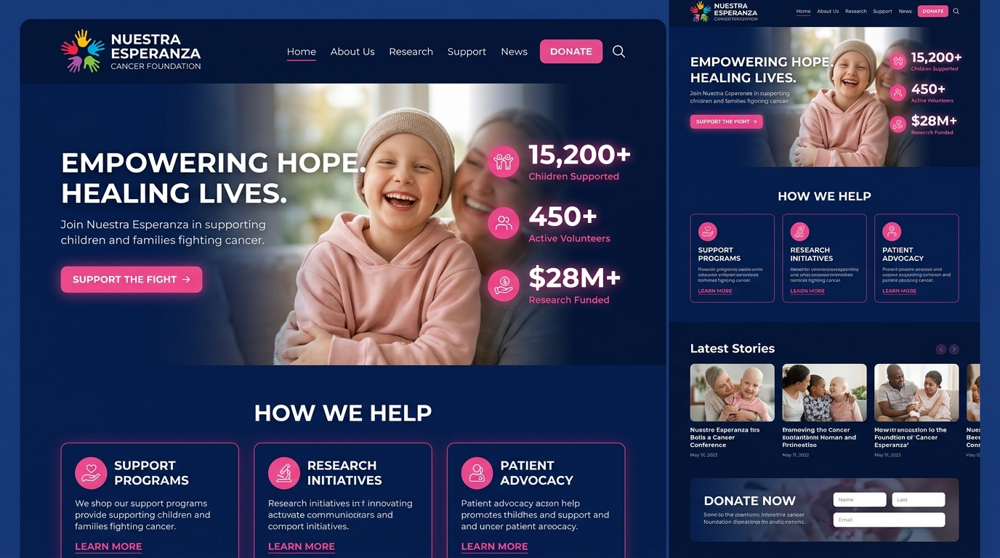

# Guía de Identidad y Sistema de Diseño Visual (Fase 1)

Esta guía establece el sistema de diseño visual de la **Fundación Nuestra Esperanza**, diseñado para transmitir profesionalismo, empatía y esperanza, tomando como base el isotipo representativo (las 5 manos de colores en círculo) y la tipografía lúdica/institucional.



---

## 1. El Isotipo y Concepto Visual
El isotipo está formado por **cinco manos de distintos colores** dispuestas en círculo, simulando una estrella o flor de apoyo comunitario. Cada mano representa un pilar:
1. **Mano Rosa:** Empatía y Calidez
2. **Mano Celeste:** Confianza y Cuidado
3. **Mano Verde:** Esperanza y Crecimiento
4. **Mano Naranja:** Energía y Acción
5. **Mano Cyan:** Transparencia y Amparo

El fondo institucional es un **Azul Oscuro Profundo (Navy Blue)** que brinda contraste, seriedad y una base sólida sobre la cual destacan los colores vibrantes del isotipo.

---

## 2. Paleta de Colores Corporativa (Tailwind CSS v4)
Definimos los códigos de color exactos basados en la identidad visual para su uso en todo el proyecto:

```css
@theme inline {
  /* Fondo principal y textos */
  --color-fundacion-blue: #00246E;        /* Azul Marino de fondo y encabezados principales */
  --color-fundacion-cream: #FDFDFB;       /* Fondo general cálido (evitar blanco puro frío) */
  --color-fundacion-dark: #1A1A1A;        /* Color para textos de lectura larga */

  /* Colores de las manos del isotipo (Acentos interactivos) */
  --color-fundacion-pink: #FF3366;        /* Rosa: Botones primarios, Donaciones, CTAs críticos */
  --color-fundacion-cyan: #00C2CB;        /* Cyan: Enlaces secundarios, botones secundarios */
  --color-fundacion-sky: #4AA3DF;         /* Celeste: Fondos suaves, bordes, estados de hover */
  --color-fundacion-green: #78B833;       /* Verde: Éxito, confirmaciones, áreas de voluntariado */
  --color-fundacion-orange: #FFA700;      /* Naranja/Amarillo: Alertas, destacados, acentos infantiles */

  /* Colores de soporte */
  --color-fundacion-pale-pink: #FFF0F3;   /* Fondo muy suave para secciones de donación */
  --color-fundacion-pale-blue: #F0F7FC;   /* Fondo muy suave para testimonios o noticias */
}
```

---

## 3. Tipografía y Jerarquía
Para lograr el balance óptimo de accesibilidad, legibilidad y el tono institucional de la fundación:
* **Títulos Primarios (H1, H2) e Impacto:** Usar fuentes amigables y redondeadas sin perder formalidad (ej. **Geist Sans** o **Outfit** con grosores `font-bold` o `font-semibold`).
* **Textos de Cuerpo (P, Li, Form):** Usar fuentes altamente legibles en pantallas con buen interlineado (`leading-relaxed` / `leading-loose`).
* **Botones e Indicadores:** Mayúsculas sostenidas (`tracking-wider`, `font-bold`).

---

## 4. UI/UX Mejorado: Propuestas de Rediseño
Basado en el análisis de la página actual, implementaremos las siguientes mejoras de UX/UI:

| Sección | Estado Actual | Mejora Propuesta (UX/UI Premium) |
| :--- | :--- | :--- |
| **Hero (Inicio)** | Imagen plana con overlay oscuro tradicional. | **Hero Dinámico:** Imagen con bordes suavizados u overlays degradados de Azul Marino a transparente, mejorando drásticamente el contraste del texto sin opacar la foto del niño. |
| **Métricas** | Stats numéricos en banda marrón opaca. | **Tarjetas de Impacto:** Números grandes en color `fundacion-cyan`/`fundacion-pink` con micro-animaciones al cargar, integrados visualmente en la landing con fondos suaves. |
| **Programas** | Tarjetas simples con fondo blanco. | **Cards Premium:** Bordes redondeados (`rounded-2xl`), sombras suaves (`shadow-sm` a `shadow-lg` en hover), y un sutil borde superior de color asignado a cada programa (ej. Albergue = Azul, Alimentación = Naranja). |
| **Testimonios** | Carrusel plano. | **Burbujas de Esperanza:** Diseño de tarjetas de testimonios simulando burbujas de diálogo con avatares circulares y estrellas de color para crear cercanía. |
| **Donaciones** | Página con texto plano. | **Grid de Métodos:** Tarjetas visuales interactivas para cada banco/método con el código QR auto-ampliable y un botón rápido de "Copiar cuenta". |
| **Contacto y Voluntariado**| Formulario básico plano. | **Campos Amigables:** Inputs con bordes redondeados y transiciones suaves de foco a `fundacion-cyan` para invitar a la acción. |

---

## 5. Elementos de Interacción (Hover y Transiciones)
* **Botones Primarios (Quiero Donar / Enviar):** Fondo `hover:bg-white hover:text-fundacion-pink duration-300 transform hover:-translate-y-0.5` con base de `fundacion-pink`.
* **Enlaces de Navegación:** Efecto de sutil subrayado animado que nace del centro usando el color `fundacion-cyan`.
