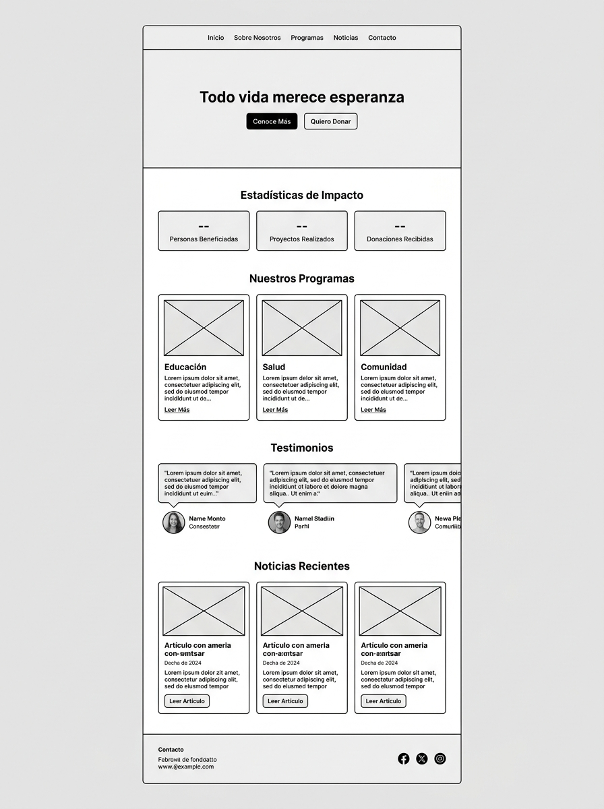
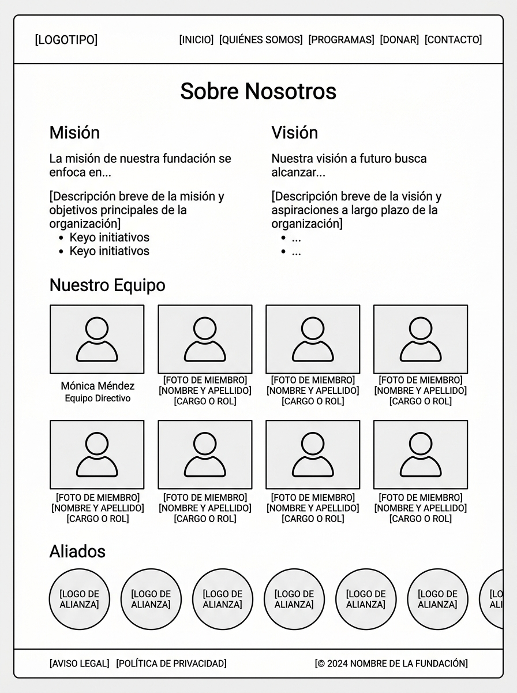
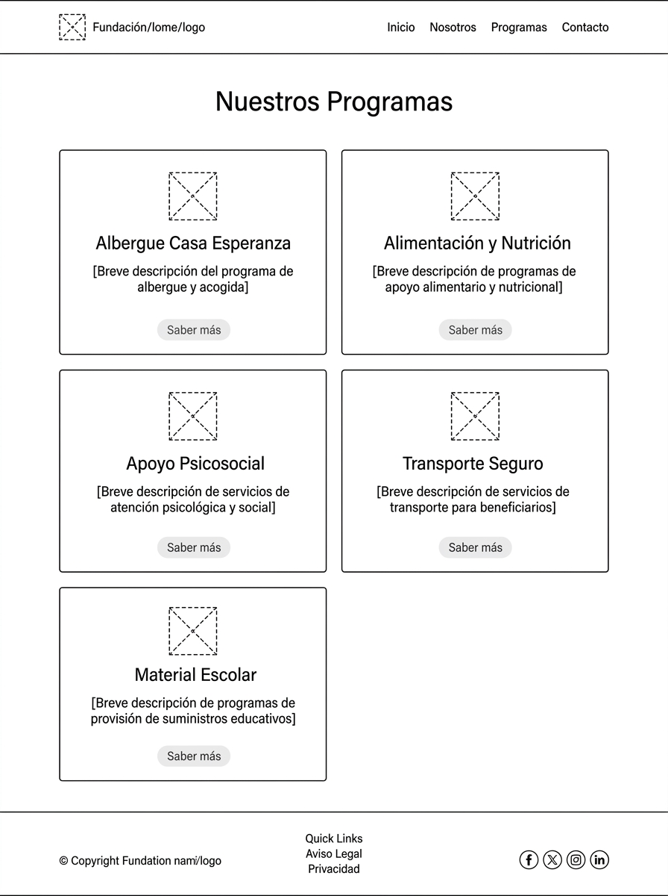
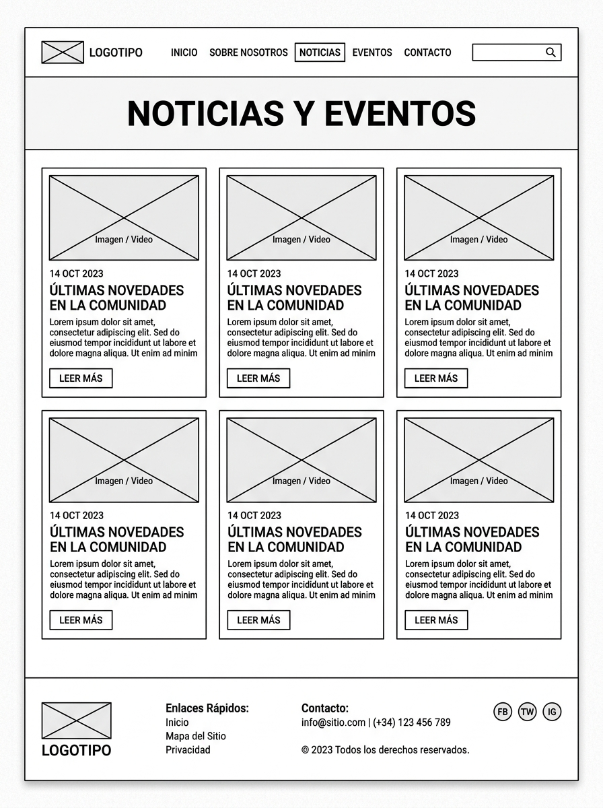
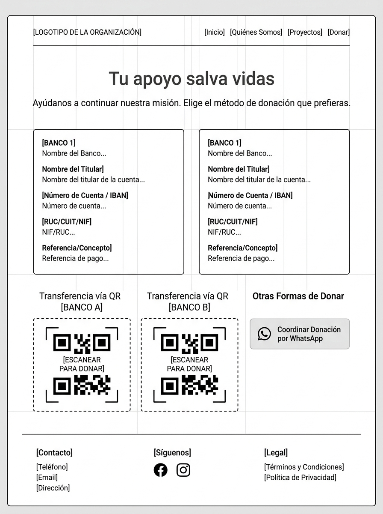
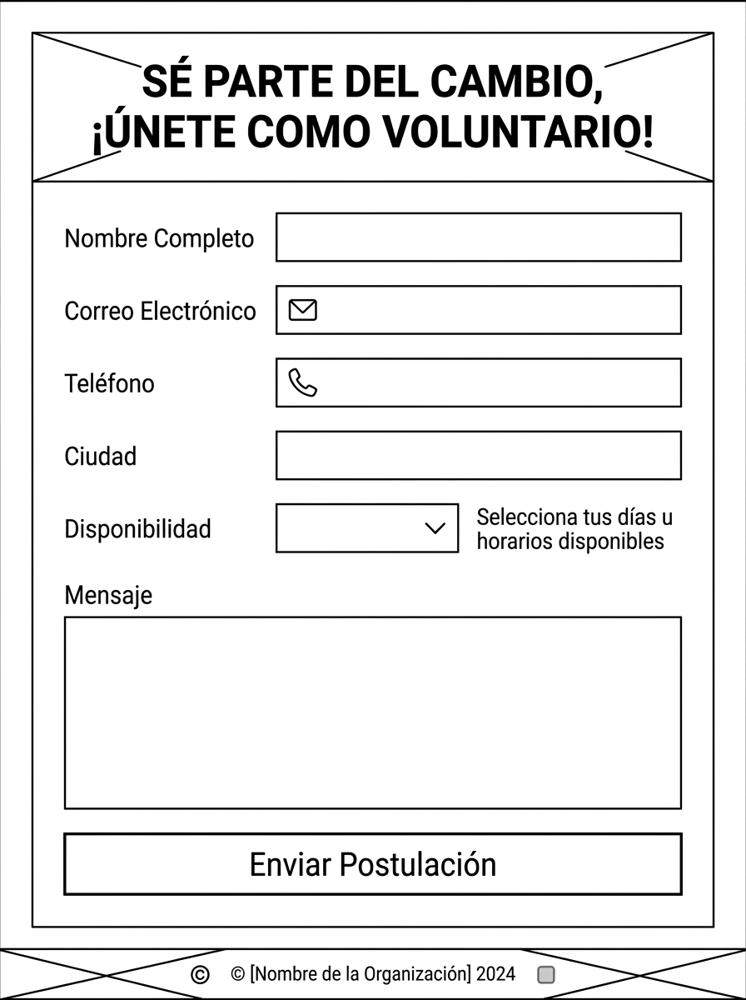
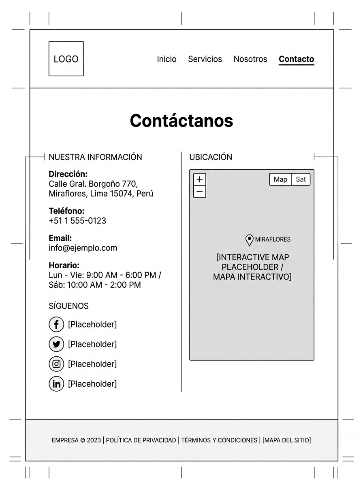
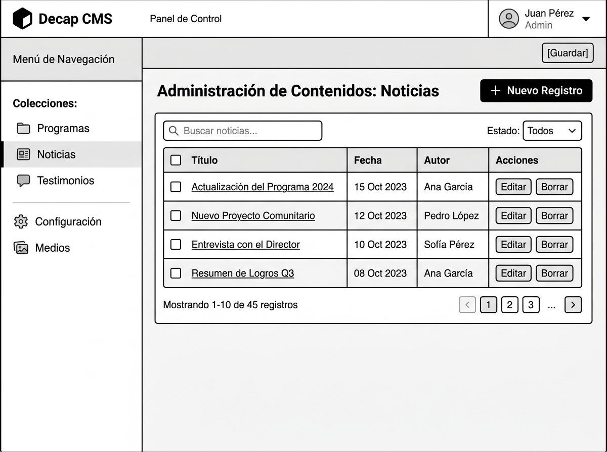

# Especificación de Wireframes Estructurales (Fase 1)

Este documento detalla la distribución de contenidos, la jerarquía visual y los planos de diseño (wireframes) individuales en español para cada sección del sitio web de la **Fundación Nuestra Esperanza**.

---

## 1. Página de Inicio (`/`)
Diseño de la landing page principal con misión, estadísticas de impacto, secciones de programas, testimonios destacados y últimas noticias.

---

## 2. Sobre Nosotros (`/about-us`)
Estructura para la sección institucional que detalla historia, misión, visión, equipo directivo y aliados de la fundación.

---

## 3. Programas (`/programs` y `/programs/[slug]`)
Visualización para el catálogo general y detalle individual autogestionable de los programas de apoyo (albergue, alimentación, apoyo psicosocial, recreación y material escolar).

---

## 4. Noticias (`/news` y `/news/[slug]`)
Layout del listado simplificado de artículos y noticias de la fundación.

---

## 5. Donaciones (`/donate`)
Página informativa con la distribución de métodos de transferencia bancaria, códigos QR y enlace de coordinación directa.

---

## 6. Voluntariado (`/volunteer`)
Formulario interactivo de postulación para nuevos voluntarios de la fundación.

---

## 7. Boletín Informativo (Newsletter)
Estructura y caja de suscripción para el registro simple de correos electrónicos.

---

## 8. Contacto (`/contact`)
Disposición de datos institucionales, formulario rápido de consulta y mapa interactivo de ubicación de la Casa Esperanza en Miraflores.

---

## 9. CMS (Decap CMS)
Estructura del panel administrativo para la gestión de contenidos de programas, noticias y testimonios.

